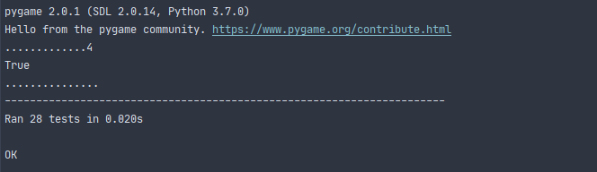
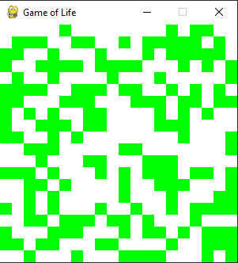
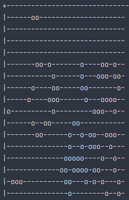

# Игра "Жизнь"

- `./data` - исходные данные в виде `.txt` файлов:


```
./data/inp.txt

01000
00100
11100
00000
00000
```

- запуск тестов в папке `./tests` производится с помощью команды:

```bash
python -m unittest discover
```



- примеры запусков файлов:

1. `life_gui.py`:

- `life_gui.py --help`

```bash
usage: life_gui.py [-h] --rows R --cols C --max-iterations IT
                   [--cell-size CS] [--input-filename IN]

Игра жизнь

optional arguments:
  -h, --help            show this help message and exit
  --rows R, -r R        Количество строк
  --cols C, -c C        Количество столбцов
  --max-iterations IT, -it IT
                        Количество итераций
  --cell-size CS, -cs CS
                        Размер ячейки
  --input-filename IN, -in IN
                        Путь к файлу с входными данными


```

- пример запуска:

```bash
./ > life_gui.py --rows 20 --cols 20 --max-iterations 1000 --cell-size 15
```

После этого необходимо нажать на любую кнопку для запуска игры. 

Для остановки игры и использовании паузы для расстановки новых клеток необходимо еще раз нажать на любую кнопку и расставить клеточки.




2. `life_console.py`

- `life_console.py --help`

```bash
usage: life_console.py [-h] --width W --height HEI [--max-iterations IT]

Игра жизнь

optional arguments:
  -h, --help            show this help message and exit
  --width W, -w W       Ширина
  --height HEI, -hei HEI
                        Высота
  --max-iterations IT, -it IT
                        Количество итераций

```



