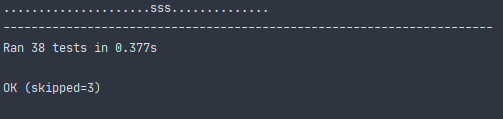

# Own Git

На данный момент сделано:

- создание пакета и инициализация репозитория (`v 0.1.0`)

```bash
pip install -e .
pyvcs init
```

Инициализируется по умолчанию папка `.pyvcs` (как в репозитории)

- реализовано хранение файлов с проверкой хэш-суммы (`v 0.2.0`)

- восстановление файлов (`v 0.3.0`)

- добавление в индекс (`v 0.4.0`)

- сохранение индекса (`v 0.5.0`)

- создание коммитов (`v 0.6.0`)

- создание ссылок и веток (`v 0.7.0`)

Пройдено 35 из 38 тестов:

- 