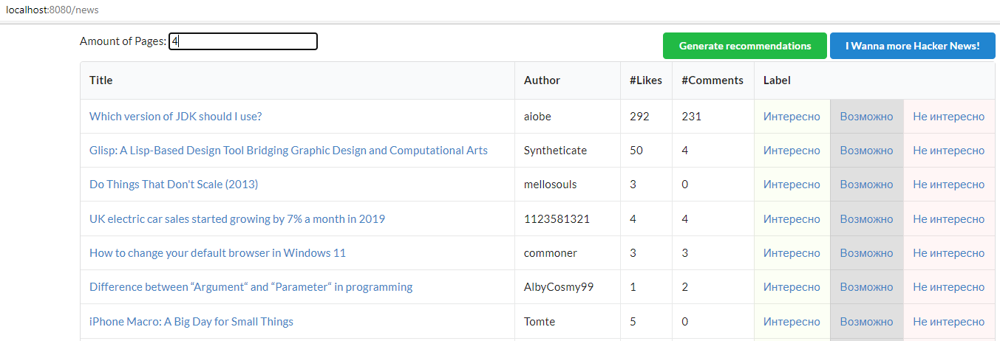
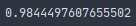
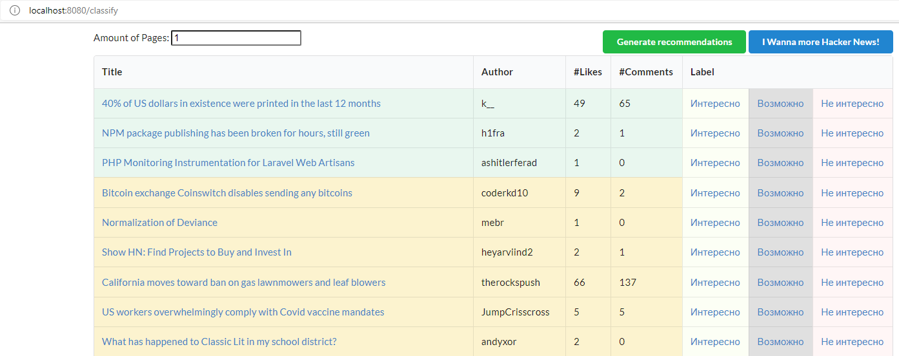
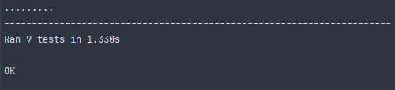

# Персонализация новостной ленты

- Реализован сбор данных с [сайта](https://news.ycombinator.com/newest)
- Создана база данных `sqlite`, расположенная в папке `./database/news.db`
- Реализована разметка данных и сохранение разметки в базу



- Реализован классификатор (`scrapper.bayes.NaiveBayesClassifier`) с точностью на тестовом наборе данных (`./data/SMSSpamCollection`) такой же, что из библиотеки sklearn



Запустить классификатор:

```bash
python scrapper/bayes.py
```

- Реализована рекомендательная система на основе наивного байесовского классификатора:




Запустить приложение:

```bash
python scrapper/hackernews.py
```

- Написаны тесты для байесовского классификатора:

```bash
python -m unittest discover
```


